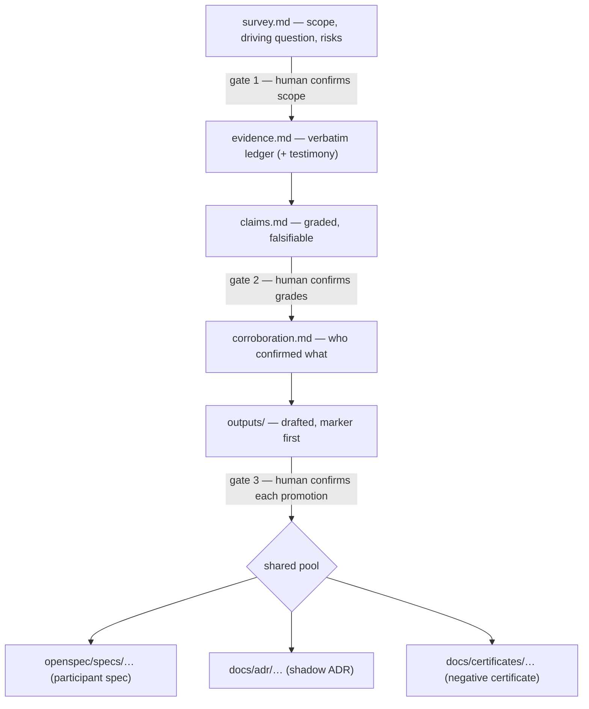

<!-- Human-first documentation. Agents: do not load this file
during pipeline actions; it is meta-guidance for humans adopting Seedbed.
The normative rules live in openspec/schemas/. -->

# Adopting Seedbed on a brownfield project

You have a living repository, real users, and code whose "why" exists mostly in
heads and git history. This guide walks the **excavation** side of Seedbed
adoption: how un-spec'ed behavior becomes labelled, graded knowledge your team —
and its agents — can actually trust. It is a practical tour with two simulated
digs; the binding rules live with the machinery, in your planning root's
`openspec/schemas/seedbed-excavation/` (its `AGENTS.md` carries the grade
legend).

## Is excavation your tool?

<table>
  <thead>
    <tr><th>Your situation</th><th>Reach for</th><th>Why</th></tr>
  </thead>
  <tbody>
    <tr>
      <td>New feature, intent still in someone's head</td>
      <td>The greenfield <code>seedbed</code> flow</td>
      <td>Intent is confirmable — no digging needed</td>
    </tr>
    <tr>
      <td>You (or a colleague) shipped it pre-SDD and remember why</td>
      <td rowspan="3"><code>/seedbed-excavate</code><br/>(the
        <code>seedbed-excavation</code> schema)</td>
      <td><em>Witnessed recovery</em> — the fast path: testimony + existing
        tests corroborate quickly</td>
    </tr>
    <tr>
      <td>Nobody knows why it exists, but it runs in production</td>
      <td><em>Archaeology</em> — same flow, poorer evidence, honestly lower
        grades</td>
    </tr>
    <tr>
      <td>An agent says "dead code, safe to delete"</td>
      <td>That claim is <b>inadmissible</b> ungraded — the dig produces the
        evidence or the refusal</td>
    </tr>
    <tr>
      <td>Bulk-importing old Jira/Confluence into specs</td>
      <td>Nothing, yet</td>
      <td>Big-bang ingestion pollutes the pool; dig just-in-time instead</td>
    </tr>
  </tbody>
</table>

**One dig = one change.** Resist the "freeze everything until 100% excavated"
pre-flight: slice per capability, promote incrementally, keep the reward loop
short. "Fully certified" means every area is _spec'ed, shadow-ADR'ed, or
honestly negative-certified_ — not "100% spec'ed".

## The flow at a glance

Three hard gates. An agent can draft everything; it can confirm nothing.



Every promoted output opens with a greppable marker — this is what keeps
recovered knowledge from impersonating confirmed intent:

```epistemics
origin: recovered
reliability: B
corroboration: 2
threshold: anchor
provenance: openspec/changes/dig-tariff-rules/claims.md#C1,C4
```

## Grades in 90 seconds

<table>
  <thead>
    <tr><th colspan="4">Two axes, graded independently (Admiralty code)</th></tr>
  </thead>
  <tbody>
    <tr>
      <td><b>Reliability</b> — the source</td>
      <td>A: re-runnable behavior (tests, traces)</td>
      <td>B: first-hand testimony, VCS, period docs</td>
      <td>C–F: second-hand → unjudgeable</td>
    </tr>
    <tr>
      <td><b>Corroboration</b> — the claim</td>
      <td>1: independently confirmed</td>
      <td>2: one independent source agrees</td>
      <td>3–6: uncorroborated → unjudgeable</td>
    </tr>
  </tbody>
</table>

<table>
  <thead>
    <tr><th>Threshold</th><th>Roughly</th><th>Default context</th><th>May justify deletion?</th></tr>
  </thead>
  <tbody>
    <tr><td><b>anchor</b></td><td>A–B × 1–2</td><td>flows in, like authored</td><td>yes</td></tr>
    <tr><td><b>hypothesis</b></td><td>anything weaker</td><td>marker-only; payload on request</td><td><b>never</b></td></tr>
  </tbody>
</table>

"Reliable source, uncorroborated claim" (B4) and "dubious source, confirmed
claim" (E2) are different situations — that is why one confidence number was
never going to work.

## Dig one: witnessed recovery (the fast path)

Ferrovia Freight rebuilt its tariff calculator eighteen months ago — pre-SDD,
validated in the field, author still on the team. The knowledge is first-hand
but slipping.

<details>
<summary><b>Simulated transcript</b> — <code>/seedbed-excavate tariff-rules</code> (condensed)</summary>

| Who   | Beat                                                                                                                                                                                                 |
| ----- | ---------------------------------------------------------------------------------------------------------------------------------------------------------------------------------------------------- |
| You   | `/seedbed-excavate tariff-rules` — that's the whole brief                                                                                                                                               |
| Agent | Bounded reconnaissance; drafts `survey.md`: subject, driving question ("which tariff behaviors must survive the next rewrite?"), mode: witnessed recovery, risks, sources (test suite, git, **you**) |
| You   | 🚧 **Gate 1** — trim one risk, confirm scope                                                                                                                                                         |
| Agent | Ledger fills: test-suite excerpts verbatim, git blame trails; then the interview: _"Why does zone 9 bypass the discount table?"_                                                                     |
| You   | "Regulatory carve-out, 2023. Check the March tickets." — recorded **verbatim** as testimony, you named as witness                                                                                    |
| Agent | The rounding algorithm is self-standing and test-poor → proposes a **characterization test**: run with unknown expectation, lock in actual output (wart included, marked `CURRENT BEHAVIOR`)         |
| Agent | Drafts claims: `C1` zone-9 carve-out (B2), `C4` rounding behavior (A1, cites the locked test), `C7` "cap exists for perf reasons" (B3 — **capped: inference**, testimony request emitted)            |
| You   | 🚧 **Gate 2** — confirm grades; C7 stays hypothesis until the old backend lead answers                                                                                                               |
| Agent | Drafts `outputs/`: participant spec (anchor claims only) + shadow ADR "evidently decided circa 2023-Q1", marker first                                                                                |
| You   | 🚧 **Gate 3** — promote both; corroboration.md records who confirmed what                                                                                                                            |

Net cost to you: one scope check, one interview, two confirmations. The pool
gains a spec and an ADR that agents can weigh — not guess about.

</details>

## Dig two: archaeology (nobody knows)

The same portal has a "rebate engine": 2014 vintage, author gone since 2017,
entangled with a half-hacky SSO webview. An agent once suggested deleting it.

<details>
<summary><b>Simulated transcript</b> — the honest ending (condensed)</summary>

| Who   | Beat                                                                                                                                                             |
| ----- | ---------------------------------------------------------------------------------------------------------------------------------------------------------------- |
| Agent | Survey drafted: mode **archaeology**; intended output "unknown — possibly only a negative certificate" (that is a valid answer)                                  |
| You   | 🚧 Gate 1 — confirm                                                                                                                                              |
| Agent | Evidence: quirky code kept ugly in the ledger, a 2015 log fragment, one dead Confluence link. Intent claims refuse to rise above hypothesis                      |
| Agent | Emits a **testimony request**: who to ask (the 2016 contractor), what to ask, what it would corroborate. Status: exhausted — unreachable                         |
| Agent | Pivots to elimination: "billing at risk — does it touch billing? No (import graph + two-cycle tombstone log). Next: auth…"                                       |
| You   | 🚧 Gates 2–3 — confirm grades and promote a **negative certificate**: eliminated risks with provenance, `verified-as-of` stamped, _no story about why it exists_ |

Nobody will ever know why the rebate engine exists. The certificate means nobody
has to re-derive what it _doesn't_ touch — and "all clear, nuke this" stays
refused, because an ungraded inference never licenses a deletion.

</details>

## When characterization tests earn their keep

"TDD after the fact": write the test with an unknown expectation, run it, lock
in the **actual** output — bugs recorded as current behavior, never fixed
mid-characterization (that would be professionalizing evidence).

- **Reach for it:** self-standing, non-leaking unit (an intricate algorithm, a
  pure transformation), no sideways evidence, and the claim must anchor.
- **Skip it:** a thorough suite already covers the behavior (that suite _is_
  authored intent frozen in code), or the behavior is environment-heavy
  (SSO-entangled UI) — evidence that by observed runs instead.
- The agent proposes candidates; you never have to triage the heuristic.

## Rebuild-as-excavation

Porting is itself an evidence procedure — every "wait, why does it do _that_?"
stumble is a claim with its falsifier attached. Keep the old system as the 100%
baseline and let the rebuild grow beside it:

```text
old   ████████████████████████ 100%  ← behavior ground truth (A-grade)
new   ███████░░░░░░░░░░░░░░░░░  30%  ← each ported slice = observed diffs,
      ↑ shared demo sandbox           ledger entries, teammate reactions
```

Shared early, the A/B sandbox pools cross-field critical thinking — stakeholder
reactions are evidence too. Record them; grade them.

## Aiming digs: the cartography layer

One dig answers one question. When the real problem is "which hundred questions,
in what order?", the excavation **cartography** at the planning root's
`docs/excavation/` (see its README) takes the strategy seat: a
singular, revisable archeology doctrine (project typology, consumer threads, fog
map) plus numbered, question-driven campaigns that aim digs and absorb their
findings. Boot or amend it with the `seedbed-chart` skill.

Two properties keep it honest:

- **Zero pool authority.** Cartography plans; digs execute. No doctrine or
  campaign text ever skips a dig gate, promotes an output, or licenses a
  deletion — the gates you confirm inside a dig remain the only path into the
  knowledge pool.
- **Fog-of-war progress, no percentages.** Campaigns report resolved versus open
  questions and name what is still dark; a shrinking roster is the goal state,
  not a dashboard number.

Conventions live in that folder's own README once the layer is booted.

## Do / Don't

| Do                                      | Don't                                |
| --------------------------------------- | ------------------------------------ |
| Keep ledger excerpts ugly and verbatim  | Polish evidence into fluent prose    |
| Record "nobody knows" as the finding    | Press for a plausible story          |
| Confirm every gate yourself             | Let the agent self-confirm anything  |
| Slice digs per capability               | Big-bang "excavate everything first" |
| Treat a stale certificate as hypothesis | Trust `verified-as-of: 2024` forever |

## Where things land

```text
openspec/changes/<dig>/     the dig itself (survey → … → outputs)
openspec/specs/<cap>/       participant specs, marker first
docs/adr/NNNN-*.md          shadow ADRs — ordinary lifecycle, recovered origin
docs/certificates/*.md      negative certificates, dated
```

Deeper, at your planning root (locate it with `openspec context --store <id>`
when planning lives outside this repository): excavation schema & grade legend
in `openspec/schemas/seedbed-excavation/AGENTS.md` · negative certificates in
`docs/certificates/` · your decision records in `docs/adr/` ·
[repository setup](repo-setup.md)
