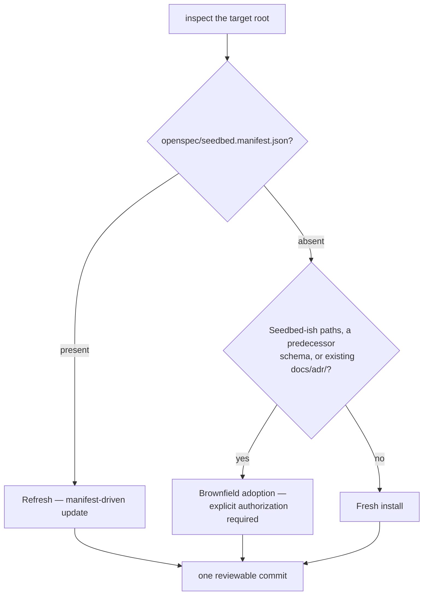

<!-- Human-first documentation. Agents: do not load this file
during pipeline actions; it is meta-guidance for humans adopting Seedbed.
The normative rules live in AGENT_INSTALL.md and openspec/schemas/. -->

# Setting up a repository with Seedbed

You decided to give Seedbed a seat in your project. This guide walks the
**distribution** side of adoption: where the harness sits, what the installer
writes (and refuses to write), and how updates flow later. It is a practical
tour with two simulated installs; the binding procedure lives with the
machinery, in
[`AGENT_INSTALL.md`](https://github.com/JulianCataldo/seedbed-sdd/blob/main/AGENT_INSTALL.md).

Two entrypoints, one channel — git plus a dependency-free, repo-shipped Node
script. Nothing lands in your dependency tree.

**Agent-first** — paste this to your agent and let it drive:

> Read this file:
> https://raw.githubusercontent.com/JulianCataldo/seedbed-sdd/main/AGENT_INSTALL.md

**By hand** — Node 20+, no `pnpm install` needed first:

```sh
git clone https://github.com/JulianCataldo/seedbed-sdd.git
node seedbed-sdd/scripts/install.mjs install /path/to/your-project
```

## Which seat is yours?

One installer, one template, four setups — codebase shape × harness seat. Name
yours **before** anything is written.

<table>
  <thead>
    <tr>
      <th></th>
      <th>Harness beside the code</th>
      <th>Harness in a separate SDD repo</th>
    </tr>
  </thead>
  <tbody>
    <tr>
      <th>Single project</th>
      <td><b>Setup 1</b> — the two-command default above. Your repo root is
        the one planning root; done.</td>
      <td><b>Setup 2</b> — planning artifacts must stay out of the code
        repo. Install into the SDD repo, wire with an
        <a href="../../AGENT_INSTALL.md#setup-2-separate-sdd-repository">OpenSpec
        store</a>.</td>
    </tr>
    <tr>
      <th>Multiple projects</th>
      <td><b>Setup 3</b> — a monorepo where each package
        <a href="../../AGENT_INSTALL.md#setup-3-monorepo-with-co-located-planning-roots">keeps
        its own planning root</a>, plus the root as orchestration ground.</td>
      <td><b>Setup 4</b> — one
        <a href="../../AGENT_INSTALL.md#setup-4-multi-project-sdd-repository">SDD
        repository planning several codebases</a>: setup 3's layout composed
        with setup 2's store wiring, per project.</td>
    </tr>
  </tbody>
</table>

Setups 2 and 4 need OpenSpec CLI **≥ 1.6.0** wherever OpenSpec commands run.

## One primitive, two layers

Every setup is a preset over one primitive: **an anchor plus the exact
planning roots you select**. The template decomposes by classification —
installer logic, not a physical split:

```text
your-monorepo/                       ← the ANCHOR (the install target)
├── .agents/  .claude/  .vscode/     ┐ anchor layer: agent skills, editor
├── docs/seedbed/  docs/specmark/    ┘ settings, guides, SpecMark data — once
└── packages/
    ├── app/                         ← a selected PLANNING ROOT
    │   ├── openspec/…               ┐ planning layer, materialized per root:
    │   └── docs/adr/  docs/…        ┘ schemas, config, artifact homes
    └── lib/ …                         (same shape)
```

Selection is exact: only the roots you list become planning roots, and the
anchor directory itself plans repo-wide work **only if you select `.`** —
there is no mandatory repo-root planning seat. A planning root can be a
repository root, a package, or a plain folder in a tenant repo; Git presence
is diagnostic, never an eligibility rule.

One transparent monorepo bootstrap: when you DO select `.` alongside other
roots, the schema machinery stays at the root store once and each sibling
root carries a single recorded `openspec/schemas` link to it — a Seedbed
update then touches the machinery once, and the trick happens at install,
once and for good. Without `.` in the selection, every root materializes in
full and no symlink exists anywhere.

The anchor layer is owned by an anchor-local manifest
(`.agents/seedbed.manifest.json`); each planning root owns its layer through
a root-local `openspec/seedbed.manifest.json` whose inventory is relative to
that root — so the folder can **move wholesale** and nothing inside it needs
a path edit. **Every managed path is owned by exactly one manifest.** Durable
ADRs anchor per root at `<planning-root>/docs/adr/`, numbering scoped per
root.

Each planning root is one sovereign OpenSpec **store** in a flat mesh:
register it per machine, declare cross-store context as committed
`references:` in its `openspec/config.yaml`, and let typed pointers do the
rest — peers all the way down, no privileged seat. Multi-store proposal
campaigns ride the `openspec-sb-multi-propose` skill under the installed schema's
`store-campaigns.md` policy.

In setup 1 all of this degenerates to "one root, one classic combined
manifest" — the matrix costs you nothing until you have the topology.

## Fresh, brownfield, or refresh?

The route is decided by what the target already carries, per planning root:



Note the vocabulary collision: _brownfield adoption_ here means **pre-existing
harness files** (an old OpenSpec setup, an ADR trail) that the installer must
incorporate without losing anything. Recovering un-spec'ed **knowledge** from a
legacy codebase is a different activity with its own guide —
[brownfield SDD adoption](brownfield-sdd-adoption.md).

## What the installer guarantees

| It will                                                                                           | It will not                                                                  |
| ------------------------------------------------------------------------------------------------- | ---------------------------------------------------------------------------- |
| Preflight every target path — one conflict means **zero writes**, all reported                    | Overwrite an unexpected file silently                                        |
| Stamp truthful provenance: Seedbed's git commit + version, manifest written last                  | Stamp from a dirty Seedbed checkout — it refuses                             |
| Replicate [`template/`](https://github.com/JulianCataldo/seedbed-sdd/tree/main/template) verbatim | Add anything to your dependency tree or `node_modules/`                      |
| Materialize the planning layer into exactly the roots you select                                  | Invent project structure — `--planning-root` directories must exist          |
| Preflight every root and the anchor before the **first** write                                    | Plant symlinks — except the one recorded bootstrap link when `.` is selected |

## Simulated install one: the monorepo (setup 3)

Solenne Studio's pnpm workspace ships `packages/app` and maintains
`packages/lib`. Planning should live next to each, not in one pile.

<details>
<summary><b>Simulated transcript</b> — fresh install, two project roots (condensed)</summary>

| Who   | Beat                                                                                                                                                                                                                                               |
| ----- | -------------------------------------------------------------------------------------------------------------------------------------------------------------------------------------------------------------------------------------------------- |
| You   | "Install Seedbed. pnpm workspace; `packages/app` and `packages/lib` each plan their own work."                                                                                                                                                     |
| Agent | Clones Seedbed to a temp dir, resolves the revision: "clean checkout at `<sha>` — install this?"                                                                                                                                                   |
| You   | 🚧 Approve the exact commit                                                                                                                                                                                                                        |
| Agent | Inspects every candidate root: no manifest, no predecessor schema, no `docs/adr/` → **fresh install**, setup 3                                                                                                                                     |
| Agent | `install.mjs install . --planning-root packages/app --planning-root packages/lib` — all-target preflight passes; the anchor manifest plus two root-local planning manifests land                                                                   |
| Agent | Reports ownership: the anchor manifest owns skills/settings/guides/SpecMark data once; each package owns its complete, materialized planning layer — schemas included, zero symlinks                                                               |
| You   | "Doesn't the _root_ need a planning layer too?"                                                                                                                                                                                                    |
| Agent | "Only if your workspace itself plans repo-wide work — release scripts, CI, cross-package conventions. Say the word and I add `--planning-root .`; the packages then share its schema machinery through one recorded link each. Nothing forces it." |
| You   | Commit the whole installation as one reviewable change                                                                                                                                                                                             |

Day-to-day afterwards: OpenSpec resolves the **nearest** `openspec/` root, so a
workflow action run inside `packages/app` acts on that package's planning root.
Each package registers as its own store when cross-store context needs it.

</details>

## Simulated install two: one SDD repo, two codebases (setup 4)

Acme keeps `acme-app-a` and `acme-app-b` free of planning files; a dedicated
`acme-sdd` repository plans both.

<details>
<summary><b>Simulated transcript</b> — install + store wiring (condensed)</summary>

| Who   | Beat                                                                                                                                                                                           |
| ----- | ---------------------------------------------------------------------------------------------------------------------------------------------------------------------------------------------- |
| You   | "Planning noise must stay out of the code repos. One SDD repo for both apps."                                                                                                                  |
| Agent | Creates `acme-sdd` with `projects/app-a` and `projects/app-b`, then installs — **install first, register second**: `openspec store setup` would scaffold a `config.yaml` the preflight rejects |
| Agent | `openspec store register projects/app-a --id acme-app-a --yes` (and `app-b`). Registering the bare repo root is refused by design — a store binds to one planning root                         |
| Agent | Commits the created `.openspec-store/store.yaml` files; flags that registration is **per machine** — every collaborator re-registers after cloning                                             |
| Agent | In each code repo, one line of `openspec/config.yaml`: `store: acme-app-a` — authored by you or the agent, following OpenSpec's own convention; no Seedbed link file exists anywhere           |
| You   | 🚧 Verify from inside a code repo: `openspec context` and `openspec doctor` must name that project's store                                                                                     |

The **harness-seat rule**: workflow actions act on the planning root that
carries the harness. Proposals, change artifacts, and each project's ADR trail
land in `acme-sdd`, whichever checkout hosts the code edits. Keeping the two
repositories in step is plain git — Seedbed adds no sync machinery.

Store ids are flat — qualify them (`acme-app-a`, not `app-a`) so sibling
projects from different SDD repos cannot collide on a teammate's machine.

</details>

## Updating later: refresh

```sh
node seedbed-sdd/scripts/install.mjs refresh /path/to/your-project                    # setup 1
node seedbed-sdd/scripts/install.mjs refresh /path/to/your-project --anchor           # anchor scope
node seedbed-sdd/scripts/install.mjs refresh /path/to/your-project --planning-root p  # one root
```

Refresh is manifest-driven and conservative — **one ownership scope per
invocation** — but it is **not** a merge:

| Path state after the new template           | Refresh does                                                                 |
| ------------------------------------------- | ---------------------------------------------------------------------------- |
| Managed before, still shipped               | **Overwritten.** There is no drift detection yet — commit local edits first  |
| New in the template, absent on disk         | Claimed                                                                      |
| New in the template, unmanaged file present | The **whole refresh aborts** for your judgment                               |
| Dropped from the template                   | Preserved on disk with your local bytes; disowned from the inventory         |
| Owned by an unselected scope                | Byte-identical, always — anchor, siblings, and your deliberate dirt included |

The overlay the selected scope owns — `openspec/config.yaml` for a planning
root, `.vscode/settings.json` for the anchor, both for classic setup 1 — is
captured before and reapplied deliberately after. Grandfathered ADRs and the
adoption boundary are never touched. Materialized roots update per root —
sibling isolation is the point; in the monorepo bootstrap, refreshing `.`
updates the shared machinery once for every linked sibling, whose recorded
link is re-created only when missing (anything already at its location is
left be).

There is no legacy shape and no migration path: refresh reads exactly what
fresh installs produce, and pre-release layout changes are recalibrations —
the deterministic script covers the clean permutations, and unicorn
situations are documented agent polyfills
([ADR-0034](https://github.com/JulianCataldo/seedbed-sdd/blob/main/docs/adr/0034-deterministic-core-agent-polyfill.md)).

Lost or broken manifest? Do not hand-craft state: back up, remove the managed
files with the developer, and rerun a fresh install selecting every planning
root — red-to-green is the supported recovery path.

## Moving a planning root

A materialized root relocates wholesale: move the folder, rebind the registry
(`openspec store unregister <id>` + `openspec store register <new-path> --id
<id> --yes`), and every artifact, manifest, and typed reference keeps working
with zero path edits. Agent/editor support at the new repository is its own
explicit step — `install <new-repo> --anchor-only` — which installs the
anchor layer beside your untouched planning root. A changed canonical remote
is a third, separately visible edit to the committed `{id, remote}` hints in
referencing stores. Three concerns, three visible operations, no magic.

A bootstrap-linked root is the acknowledged edge case: unwire it first (copy
the link target over the link, claim the machinery in its manifest — a
one-copy agent polyfill), and from there it is an ordinary materialized root.

## When the repo already carries a harness

Brownfield adoption runs only with your explicit authorization, and its posture
is "**Seedbed wins the mechanical base** — the target keeps its intent":

- Clean working tree first, untracked files included — commit your work, don't
  let an agent stash it.
- Every path to be replaced is backed up **outside** the target and kept until
  you accept the diff.
- Pre-existing ADRs are preserved **byte-for-byte** and hashed into
  `openspec/seedbed.adoption.json` — membership in that reviewed file, not
  formatting guesses, marks pre-Seedbed history. Nobody retrofits your legacy
  records.
- Your `openspec/config.yaml` context and `.vscode/settings.json` are reapplied
  as deliberate overlays, not clobbered.
- Everything is left **uncommitted** — the final diff is yours to accept.

The full step list lives in
[the agent instructions](https://github.com/JulianCataldo/seedbed-sdd/blob/main/AGENT_INSTALL.md#brownfield-adoption).

### Windows

Installs without `.` in the selection plant **no symlinks at all** — nothing
to enable, no per-OS branch. The monorepo bootstrap link (`.` selected among
several roots) is the one exception: where symlinks are unavailable, avoid
that combination or hand-copy the machinery over the link location afterward
— refresh preserves whatever already sits there.

## Do / Don't

| Do                                                | Don't                                                           |
| ------------------------------------------------- | --------------------------------------------------------------- |
| Name the setup (1–4) before anything is written   | Let an agent guess the topology from vibes                      |
| Approve the exact Seedbed commit being installed  | Install from a dirty or unreviewed checkout                     |
| Commit local edits before any refresh             | Expect drift detection — there is none yet                      |
| Select `.` explicitly when the root should plan   | Assume the repo root is a planning seat by default              |
| Refresh one scope at a time, from the anchor      | Run refresh inside a package as if it were standalone — refused |
| Install first, `store register` second            | Start with `openspec store setup` — its scaffold collides       |
| Unwire a linked root by hand before extracting it | Expect migration machinery — one shape, agent polyfills         |
| Reinstall red-to-green when a manifest is lost    | Hand-craft manifest or adoption state                           |

## Where things land

```text
openspec/seedbed.manifest.json     classic combined manifest (setup 1), or the
                                   root-local planning manifest (scope: planning)
.agents/seedbed.manifest.json      anchor manifest (scope: anchor): skills,
                                   editor settings, guides, SpecMark data
openspec/seedbed.adoption.json     brownfield boundary: grandfathered ADRs, hashed
.openspec-store/store.yaml         store metadata beside each registered root (commit it)
<planning-root>/docs/adr/          durable ADRs, numbering scoped per root
<planning-root>/openspec/schemas/  schema machinery — materialized per root, or one
                                   recorded link to the root store (monorepo bootstrap)
docs/seedbed/                      these guides — anchor reference content,
                                   never propagated per planning root
```

Deeper:
[agent install instructions](https://github.com/JulianCataldo/seedbed-sdd/blob/main/AGENT_INSTALL.md)
·
[README install section](https://github.com/JulianCataldo/seedbed-sdd#install-the-harness-into-your-project)
· your decision records in the planning root's `docs/adr/`

Sibling guides: [working a change](working-a-change.md) ·
[steward operations](steward-operations.md) ·
[brownfield SDD adoption](brownfield-sdd-adoption.md)
